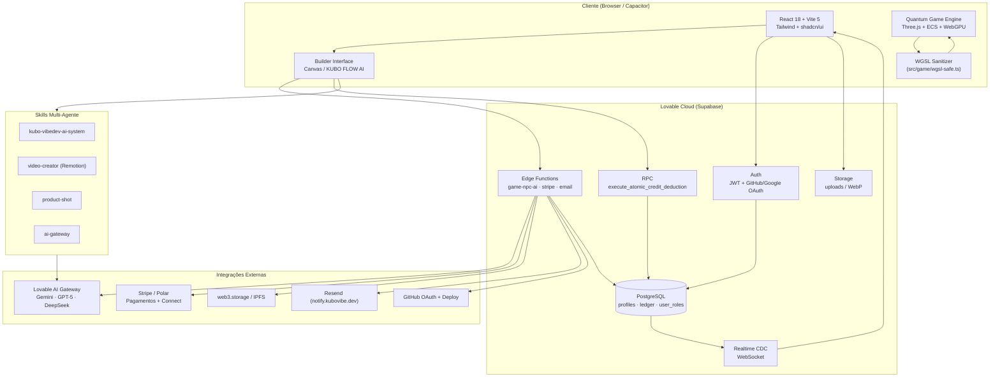
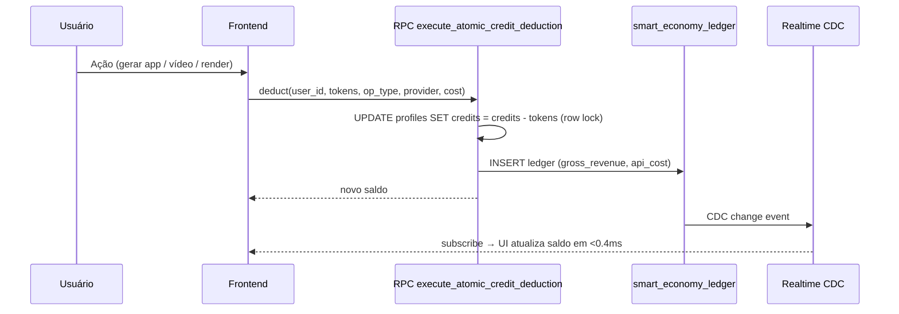
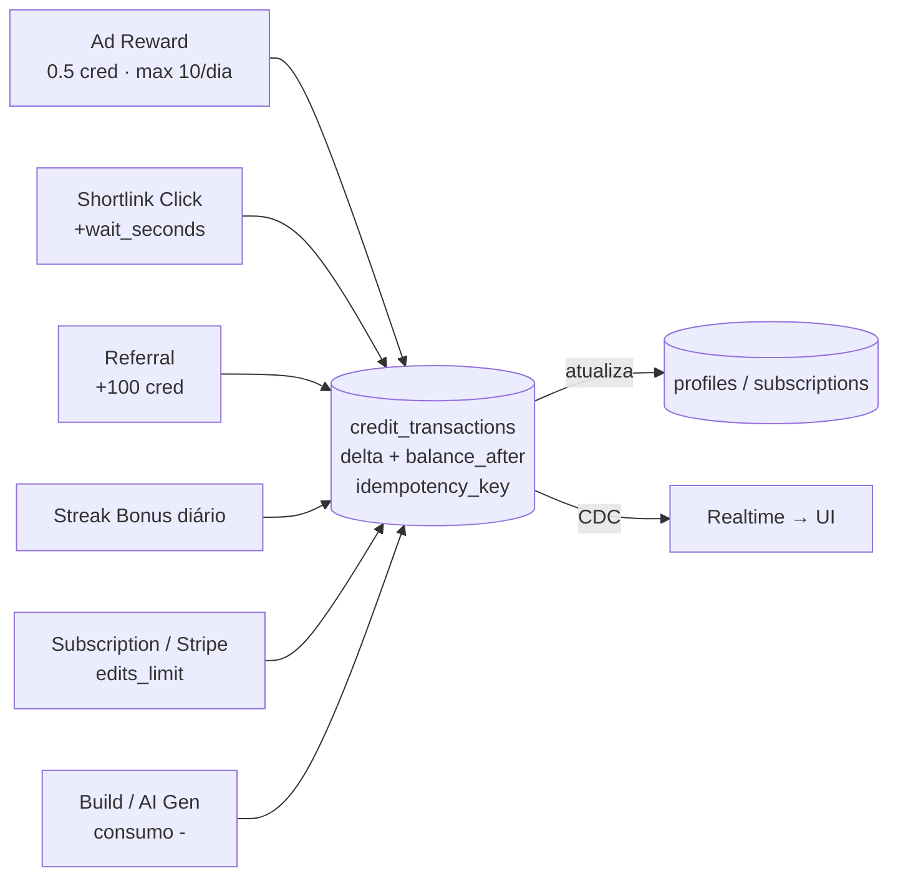

# Kubo VibeDev

> Plataforma autônoma de criação, execução e monetização de software baseada em IA.
> Transforma ideias em produtos digitais completos — SaaS, metaversos, jogos AAA e aplicações Web3.

---

## Visão Geral

O **Kubo VibeDev** é uma plataforma SaaS com inteligência artificial que permite a criação automática de aplicações digitais, incluindo sistemas Web2 e Web3.

**O que ele faz:**
- Gera aplicações completas (frontend + backend)
- Cria APIs e microserviços automaticamente
- Estrutura bancos de dados PostgreSQL
- Realiza deploy em cloud
- Integra sistemas de pagamento e blockchain
- Cria jogos 2D/3D, metaversos e MMOs via **Quantum Game Engine**
- Produz vídeos motion graphics, mockups de produto e assets de IA

**URL de Produção:** https://kubovibe.dev  
**Preview:** https://id-preview--5ce8b966-167f-4e5a-be1c-165ac92bd64e.lovable.app

---

## Skills do Sistema (IA Multi-Agente)

O Kubo VibeDev opera com 4 skills de IA especializadas, acionadas automaticamente ou via `/` no chat:

| Skill | Status | Função |
|-------|--------|--------|
| **kubo-vibedev-ai-system** | Ativa | Orquestração multiagente + Quantum Game Engine |
| **video-creator** | Ativa | Vídeos motion graphics via Remotion |
| **product-shot** | Ativa | Screenshots polidos com frame macOS + mesh gradients |
| **ai-gateway** | Ativa | Scripts que chamam modelos AI via Lovable AI Gateway |

### kubo-vibedev-ai-system
Orquestra o ecossistema completo. Quando ativada, a IA instancia imediatamente a equipe multiagente (Dev, UI, Backend, Deploy, Data & Ops, Autonomous Action) para execução paralela. Inclui o **Kubo VibeDev Quantum Game Creator** — sistema AI-FIRST avançado que transforma prompts em jogos completos de nível AAA.

### video-creator
Cria vídeos motion graphics em qualidade de agência usando **Remotion + React + Tailwind**, renderizando MP4 via CLI headless para `/mnt/documents/`. Use quando precisar de vídeo, motion, animação cinematográfica, trailer ou peça de marketing animada.

### product-shot
Gera screenshots de produto polidos (frame macOS com traffic lights, cantos arredondados, sombra e mesh gradient) a partir de uma captura do app. Use para mockup, hero image, screenshot bonito ou imagem para landing/marketing. Presets: `sunset`, `ocean`, `aurora`, `candy`, `midnight`, `fog`, `peach`, `arctic`, `ember`, `lavender`.

### ai-gateway
Chama modelos AI (texto, JSON estruturado, batch, geração e edição de imagem) a partir de scripts no sandbox via Lovable AI Gateway, sem precisar de API key extra. Modelo padrão: `google/gemini-3-flash-preview`.

---

## Diagrama de Arquitetura



### Fluxo de Crédito Atômico



### ERD — Smart Economy Core

Modelo de dados das tabelas envolvidas no ledger de créditos atômicos. As relações são lógicas via `user_id` (sem foreign keys físicas, para isolar deleções de `auth.users` e permitir RLS por `auth.uid()`).

```mermaid
erDiagram
    AUTH_USERS ||--|| PROFILES : "1:1 (id)"
    AUTH_USERS ||--o| SUBSCRIPTIONS : "1:1 (user_id)"
    AUTH_USERS ||--o{ CREDIT_TRANSACTIONS : "1:N (user_id)"
    AUTH_USERS ||--o{ AD_REWARDS : "1:N (user_id)"
    AUTH_USERS ||--o{ SHORTLINK_CLICKS : "1:N (user_id)"
    AUTH_USERS ||--o{ USER_BADGES : "1:N (user_id)"
    AUTH_USERS ||--|| USER_STREAKS : "1:1 (user_id)"
    AUTH_USERS ||--o{ REFERRALS : "referrer_id / referred_id"
    SHORTLINKS  ||--o{ SHORTLINK_CLICKS : "1:N (shortlink_id)"

    AUTH_USERS {
        uuid id PK
        text email
    }

    PROFILES {
        uuid id PK "= auth.users.id"
        text display_name
        text avatar_url
        text referral_code
        timestamptz created_at
        timestamptz updated_at
    }

    SUBSCRIPTIONS {
        uuid id PK
        uuid user_id FK
        text plan "beta|starter|ultra"
        int  edits_limit
        int  edits_used
        bool is_active
        timestamptz paid_at
    }

    CREDIT_TRANSACTIONS {
        uuid id PK
        uuid user_id FK
        int  delta "+ ganho / - consumo"
        int  balance_after
        text reason
        text category
        text idempotency_key UK
        jsonb metadata
        timestamptz created_at
    }

    AD_REWARDS {
        uuid id PK
        uuid user_id FK
        text ad_type "unity_rewarded|youtube"
        numeric reward_credits "default 0.5"
        timestamptz created_at
    }

    SHORTLINKS {
        uuid id PK
        text slug UK
        text destination_url
        numeric reward_credits
        int  wait_seconds
        bool is_active
    }

    SHORTLINK_CLICKS {
        uuid id PK
        uuid user_id FK
        uuid shortlink_id FK
        bool completed
        numeric reward_credited
        text ip_address
        timestamptz clicked_at
        timestamptz completed_at
    }

    REFERRALS {
        uuid id PK
        uuid referrer_id FK
        uuid referred_id FK
        numeric credits_awarded "default 100"
        timestamptz created_at
    }

    USER_STREAKS {
        uuid id PK
        uuid user_id FK
        int  current_streak
        int  longest_streak
        date last_activity_date
    }

    USER_BADGES {
        uuid id PK
        uuid user_id FK
        text badge_type
        timestamptz unlocked_at
    }
```



### Fontes de Crédito → Ledger



> Toda mutação de saldo passa por `execute_atomic_credit_deduction` (row-lock + INSERT no ledger na mesma transação). `idempotency_key` evita dupla contagem em webhooks (Stripe, Unity Ads, shortlinks).

---

### Dicionário de Dados — Smart Economy Core

Convenções: **PK** = chave primária · **FK*** = relação lógica (sem foreign key física, validada por RLS via `auth.uid()`) · **UK** = unique · timestamps em `timestamptz` UTC.

#### `profiles`
Espelho público de `auth.users`. Criado automaticamente pelo trigger `handle_new_user` no signup.

| Campo | Tipo | Chave | Nulo | Default | Descrição |
|---|---|---|---|---|---|
| `id` | uuid | PK · FK*→`auth.users.id` | não | — | Mesmo id do usuário em `auth.users` (1:1). |
| `display_name` | text | — | sim | — | Nome exibido (cai para `email` se ausente). |
| `avatar_url` | text | — | sim | — | URL pública do avatar (bucket `avatars`, com cache-bust por timestamp). |
| `referral_code` | text | UK | sim | — *(trigger `handle_new_user` → `substr(id::text,1,8)`)* | Código de indicação único de 8 chars. |
| `created_at` | timestamptz | — | não | `now()` | Criação. |
| `updated_at` | timestamptz | — | não | `now()` | Última atualização. |

#### `subscriptions`
Plano ativo e cota de créditos do usuário. Linha bloqueada via `FOR UPDATE` na RPC.

| Campo | Tipo | Chave | Nulo | Default | Descrição |
|---|---|---|---|---|---|
| `id` | uuid | PK | não | `gen_random_uuid()` | Identificador da assinatura. |
| `user_id` | uuid | FK*→`auth.users.id` | não | — | Dono da assinatura (1:1 ativa por usuário). |
| `plan` | text | — | não | `'beta'` | `beta` · `starter` · `ultra`. |
| `edits_limit` | int | — | não | `20` | Cota total de créditos do ciclo. |
| `edits_used` | int | — | não | `0` | Consumidos no ciclo. Saldo = `edits_limit - edits_used`. |
| `is_active` | bool | — | não | `true` | Se `false`, RPC rejeita com `subscription_not_found`. |
| `paid_at` | timestamptz | — | sim | `now()` | Último pagamento confirmado (Stripe/Polar webhook). |
| `created_at` / `updated_at` | timestamptz | — | não | `now()` | Auditoria. |

#### `credit_transactions` — ledger imutável
Toda mutação de saldo grava aqui dentro da mesma transação do `UPDATE subscriptions`.

| Campo | Tipo | Chave | Nulo | Default | Descrição |
|---|---|---|---|---|---|
| `id` | uuid | PK | não | `gen_random_uuid()` | Id da transação. |
| `user_id` | uuid | FK*→`auth.users.id` | não | — | Dono. |
| `delta` | int | — | não | — | `+` ganho / `−` consumo. |
| `balance_after` | int | — | não | — | Saldo resultante (snapshot). |
| `reason` | text | — | não | — | Texto humano (ex.: `ai_generation`, `ad_reward`). |
| `category` | text | — | não | `'general'` | Bucket para analytics. |
| `metadata` | jsonb | — | não | `'{}'` | Payload livre (op_type, provider, api_cost, etc.). |
| `idempotency_key` | text | UK por `user_id` | sim | — | Bloqueia replay de webhook (Stripe, Unity, shortlinks). |
| `created_at` | timestamptz | — | não | `now()` | Insert time. |

#### `ad_rewards`
Recompensas por anúncios assistidos (Unity Ads nativo / YouTube fallback web).

| Campo | Tipo | Chave | Nulo | Default | Descrição |
|---|---|---|---|---|---|
| `id` | uuid | PK | não | `gen_random_uuid()` | — |
| `user_id` | uuid | FK*→`auth.users.id` | não | — | Quem recebeu. |
| `ad_type` | text | — | não | `'unity_rewarded'` | `unity_rewarded` · `youtube`. |
| `reward_credits` | numeric | — | não | `0.5` | Créditos creditados (limite 10/dia). |
| `created_at` | timestamptz | — | não | `now()` | Anti-fraude por janela diária. |

#### `shortlinks`
Catálogo público de links monetizados. Somente `service_role` escreve.

| Campo | Tipo | Chave | Nulo | Default | Descrição |
|---|---|---|---|---|---|
| `id` | uuid | PK | não | `gen_random_uuid()` | — |
| `slug` | text | UK | não | — | Slug público (`/l/:slug`). |
| `title` | text | — | não | `'Shortlink'` | Rótulo. |
| `destination_url` | text | — | não | — | Destino final após espera. |
| `reward_credits` | numeric | — | não | `0.5` | Pago por click válido. |
| `wait_seconds` | int | — | não | `8` | Tempo mínimo antes do redirect (anti-bot). |
| `is_active` | bool | — | não | `true` | Visível para `anon`/`authenticated`. |
| `created_at` | timestamptz | — | não | `now()` | — |

#### `shortlink_clicks`
Sessões de click — uma por (user, shortlink, tentativa). Crédito só com `completed=true`.

| Campo | Tipo | Chave | Nulo | Default | Descrição |
|---|---|---|---|---|---|
| `id` | uuid | PK | não | `gen_random_uuid()` | — |
| `user_id` | uuid | FK*→`auth.users.id` | não | — | Clicador autenticado. |
| `shortlink_id` | uuid | FK*→`shortlinks.id` | não | — | Link clicado. |
| `ip_address` | text | — | sim | — | Auditoria anti-fraude. |
| `completed` | bool | — | não | `false` | `true` após `wait_seconds`. |
| `reward_credited` | numeric | — | não | `0` | Quanto foi pago (snapshot). |
| `clicked_at` | timestamptz | — | não | `now()` | Início. |
| `completed_at` | timestamptz | — | sim | — | Quando virou elegível. |

#### `referrals`
Indicações resgatadas — gravadas pelo trigger `handle_new_user` quando o novo usuário traz `referral_code`.

| Campo | Tipo | Chave | Nulo | Default | Descrição |
|---|---|---|---|---|---|
| `id` | uuid | PK | não | `gen_random_uuid()` | — |
| `referrer_id` | uuid | FK*→`auth.users.id` | não | — | Quem indicou (recebe os créditos). |
| `referred_id` | uuid | FK*→`auth.users.id` | não | — | Novo usuário. |
| `credits_awarded` | numeric | — | não | `100` | Bônus aplicado em `subscriptions.edits_limit`. |
| `created_at` | timestamptz | — | não | `now()` | — |

#### `user_streaks`
Sequência diária para gamificação e leaderboard.

| Campo | Tipo | Chave | Nulo | Default | Descrição |
|---|---|---|---|---|---|
| `id` | uuid | PK | não | `gen_random_uuid()` | — |
| `user_id` | uuid | FK*→`auth.users.id` (1:1) | não | — | Dono. |
| `current_streak` | int | — | não | `0` | Dias consecutivos atuais. |
| `longest_streak` | int | — | não | `0` | Recorde — usado para ranking do Top 50. |
| `last_activity_date` | date | — | sim | — | Última atividade contada. |
| `created_at` / `updated_at` | timestamptz | — | não | `now()` | — |

#### `user_badges`
Conquistas permanentes desbloqueadas (visíveis no perfil público).

| Campo | Tipo | Chave | Nulo | Default | Descrição |
|---|---|---|---|---|---|
| `id` | uuid | PK | não | `gen_random_uuid()` | — |
| `user_id` | uuid | FK*→`auth.users.id` | não | — | Dono. |
| `badge_type` | text | — | não | — | Slug da conquista (ex.: `first_app`, `streak_30`). |
| `unlocked_at` | timestamptz | — | não | `now()` | Quando foi obtida (somente `service_role` insere). |

---

### Índices e Constraints — Smart Economy Core

Índices do PostgreSQL (incluindo únicos) para as tabelas do núcleo econômico. Todos são `btree`.

#### `profiles`
| Índice | Tipo | Coluna(s) | Descrição |
|---|---|---|---|
| `profiles_pkey` | UNIQUE | `id` | Chave primária (mesmo UUID de `auth.users.id`). |
| `profiles_referral_code_key` | UNIQUE | `referral_code` | Garante unicidade do código de indicação de 8 chars. |

#### `subscriptions`
| Índice | Tipo | Coluna(s) | Descrição |
|---|---|---|---|
| `subscriptions_pkey` | UNIQUE | `id` | Chave primária da assinatura. |
| `subscriptions_user_id_key` | UNIQUE | `user_id` | Garante 1 assinatura ativa por usuário (usada pelo `FOR UPDATE` na RPC). |

#### `credit_transactions` — ledger
| Índice | Tipo | Coluna(s) | Filtro / Ordem | Descrição |
|---|---|---|---|---|
| `credit_transactions_pkey` | UNIQUE | `id` | — | Chave primária do ledger. |
| `credit_transactions_idem_uniq` | UNIQUE | `user_id`, `idempotency_key` | `WHERE idempotency_key IS NOT NULL` | Impede replay de webhooks (Stripe, Unity, shortlinks). |
| `credit_transactions_user_created_idx` | INDEX | `user_id`, `created_at` | `DESC` | Histórico rápido de transações por usuário (últimas primeiro). |

#### `ad_rewards`
| Índice | Tipo | Coluna(s) | Descrição |
|---|---|---|---|
| `ad_rewards_pkey` | UNIQUE | `id` | Chave primária. |

> Nota: o anti-fraude de limite diário (max 10/dia) é aplicado em Edge Function / client-side; não há constraint de banco nessa tabela além da PK.

#### `shortlinks`
| Índice | Tipo | Coluna(s) | Descrição |
|---|---|---|---|
| `shortlinks_pkey` | UNIQUE | `id` | Chave primária. |
| `shortlinks_slug_key` | UNIQUE | `slug` | Slug público (`/l/:slug`) obrigatoriamente único. |

#### `shortlink_clicks`
| Índice | Tipo | Coluna(s) | Descrição |
|---|---|---|---|
| `shortlink_clicks_pkey` | UNIQUE | `id` | Chave primária da sessão de click. |

> Nota: não há índice composto em `(user_id, shortlink_id)` porque a validação de elegibilidade (único click por usuário/link) é feita em lógica de aplicação + timer `wait_seconds`.

#### `referrals`
| Índice | Tipo | Coluna(s) | Descrição |
|---|---|---|---|
| `referrals_pkey` | UNIQUE | `id` | Chave primária. |
| `referrals_referred_id_key` | UNIQUE | `referred_id` | Um usuário só pode ser indicado uma vez (1:1 com `referred_id`). |

#### `user_streaks`
| Índice | Tipo | Coluna(s) | Descrição |
|---|---|---|---|
| `user_streaks_pkey` | UNIQUE | `id` | Chave primária. |
| `user_streaks_user_id_key` | UNIQUE | `user_id` | Um streak por usuário (usado no leaderboard Top 50). |

#### `user_badges`
| Índice | Tipo | Coluna(s) | Descrição |
|---|---|---|---|
| `user_badges_pkey` | UNIQUE | `id` | Chave primária. |
| `user_badges_user_id_badge_type_key` | UNIQUE | `user_id`, `badge_type` | Impede duplicação da mesma conquista para o mesmo usuário. |

---

### Triggers do Banco — Listagem Completa

Triggers ativos no banco (schemas `public`, `auth` e `storage`), com timing, evento, tabela/colunas afetadas e função executada. Lista extraída de `information_schema.triggers` + `pg_trigger`.

> **Nota sobre contagem:** o catálogo `information_schema.triggers` conta **cada evento separadamente**. O trigger `enforce_bucket_name_length_trigger` em `storage.buckets` aparece em **duas linhas** (`INSERT` e `UPDATE`), o que eleva o total de 14 "trigger names" para **15 linhas no catálogo**. O README lista ambas as linhas para refletir o schema real.

#### Schema `auth`

| Trigger | Tabela | Timing | Evento | Função | Tabelas/colunas afetadas |
|---|---|---|---|---|---|
| `on_auth_user_created` | `auth.users` | `AFTER` | `INSERT` | `public.handle_new_user()` (SECURITY DEFINER) | **Insere em `public.profiles`** (`id`, `display_name`, `referral_code`). Se houver `referral_code` em `raw_user_meta_data`: **insere em `public.referrals`** (`referrer_id`, `referred_id`, `credits_awarded=100`) e **atualiza `public.subscriptions.edits_limit`** (`+100`) do referrer. Dispara `net.http_post` → Edge Function `send-transactional-email`. |

> `profiles.referral_code` e `profiles.display_name` **não têm `DEFAULT` na DDL** — este trigger é a única fonte desses valores.

#### Schema `public` — `touch_updated_at()` (`BEFORE UPDATE`)

Trigger genérico que executa `NEW.updated_at = now(); RETURN NEW;`. Garante timestamp transacional independentemente do cliente.

| Trigger | Tabela | Timing | Evento | Coluna afetada |
|---|---|---|---|---|
| `api_credentials_touch` | `public.api_credentials` | `BEFORE` | `UPDATE` | `updated_at` |
| `trg_audit_shares_updated` | `public.audit_shares` | `BEFORE` | `UPDATE` | `updated_at` |
| `gmail_accounts_touch` | `public.gmail_accounts` | `BEFORE` | `UPDATE` | `updated_at` |
| `trg_npc_memories_updated_at` | `public.npc_memories` | `BEFORE` | `UPDATE` | `updated_at` |
| `render_policies_touch` | `public.render_auto_heal_policies` | `BEFORE` | `UPDATE` | `updated_at` |
| `render_connections_touch` | `public.render_connections` | `BEFORE` | `UPDATE` | `updated_at` |
| `trg_slide_decks_updated` | `public.slide_decks` | `BEFORE` | `UPDATE` | `updated_at` |
| `trg_slide_pages_updated` | `public.slide_pages` | `BEFORE` | `UPDATE` | `updated_at` |
| `web3_connections_touch_updated_at` | `public.web3_connections` | `BEFORE` | `UPDATE` | `updated_at` |

#### Schema `storage` (gerenciado pelo Supabase)

| Trigger | Tabela | Timing | Evento | Função | Efeito |
|---|---|---|---|---|---|
| `enforce_bucket_name_length_trigger` | `storage.buckets` | `BEFORE` | `INSERT` | `storage.enforce_bucket_name_length()` | Valida tamanho do nome do bucket antes de inserir. |
| `enforce_bucket_name_length_trigger` | `storage.buckets` | `BEFORE` | `UPDATE` | `storage.enforce_bucket_name_length()` | Valida tamanho do nome do bucket antes de atualizar. |
| `protect_buckets_delete` | `storage.buckets` | `BEFORE` | `DELETE` | `storage.protect_delete()` | Bloqueia deleção indevida de buckets do sistema. |
| `protect_objects_delete` | `storage.objects` | `BEFORE` | `DELETE` | `storage.protect_delete()` | Bloqueia deleção indevida de objetos protegidos. |
| `update_objects_updated_at` | `storage.objects` | `BEFORE` | `UPDATE` | `storage.update_updated_at_column()` | Atualiza `updated_at` da row de objeto. |

#### Resumo por timing/evento

- **`AFTER INSERT`**: 1 trigger (`on_auth_user_created`) — orquestra criação de perfil/referral/email.
- **`BEFORE UPDATE`**: 11 triggers — 9 de `touch_updated_at` (public) + 1 de `enforce_bucket_name_length` (storage.buckets) + 1 de `update_objects_updated_at` (storage.objects).
- **`BEFORE INSERT`**: 1 trigger (`enforce_bucket_name_length_trigger` em `storage.buckets`).
- **`BEFORE DELETE`**: 2 triggers (`protect_buckets_delete`, `protect_objects_delete`).

**Total: 15 linhas no catálogo** (`information_schema.triggers`) — `enforce_bucket_name_length_trigger` conta como 2 linhas (INSERT + UPDATE) porque o catálogo indexa por `(trigger_name, event_manipulation)`.

> Schemas `auth` e `storage` são reservados pelo Supabase — não modificar diretamente. A única dependência aplicacional é `on_auth_user_created`, que invoca código no schema `public`.

---

### Funções Executadas pelas Triggers — Detalhamento

Detalhe de cada função SQL/PLpgSQL invocada pelas triggers acima: assinatura, retorno, efeitos no banco e tratamento de erro.

#### `public.handle_new_user() RETURNS trigger`

- **Trigger que invoca:** `on_auth_user_created` (AFTER INSERT em `auth.users`).
- **Segurança:** `SECURITY DEFINER`, `search_path = public`.
- **Retorno:** `NEW` (row inserida em `auth.users`, inalterada — é AFTER, então não modifica o registro original).
- **Modifica:**
  1. `INSERT INTO public.profiles (id, display_name, referral_code)` — sempre, para todo novo usuário.
     - `id ← NEW.id`
     - `display_name ← COALESCE(NEW.raw_user_meta_data->>'display_name', NEW.email)`
     - `referral_code ← substr(NEW.id::text, 1, 8)`
  2. Se `NEW.raw_user_meta_data->>'referral_code'` existir e bater com um `profiles.referral_code` de outro usuário:
     - `INSERT INTO public.referrals (referrer_id, referred_id, credits_awarded=100)`
     - `UPDATE public.subscriptions SET edits_limit = edits_limit + 100, updated_at = now() WHERE user_id = referrer AND is_active = true`
     - `PERFORM net.http_post(...)` → Edge Function `send-transactional-email` com template `referral-notification` e `idempotencyKey = 'referral-<referrer>-<referred>'`.
- **Tratamento de erro:** o bloco de notificação por email está envolvido em `BEGIN ... EXCEPTION WHEN OTHERS THEN RAISE WARNING` — falha de email **não aborta** o signup. Falhas de `INSERT` em `profiles`/`referrals` **propagam** e abortam a transação.

#### `public.touch_updated_at() RETURNS trigger`

- **Triggers que invocam (9):** `api_credentials_touch`, `trg_audit_shares_updated`, `gmail_accounts_touch`, `trg_npc_memories_updated_at`, `render_policies_touch`, `render_connections_touch`, `trg_slide_decks_updated`, `trg_slide_pages_updated`, `web3_connections_touch_updated_at`.
- **Segurança:** sem `SECURITY DEFINER` (executa como o usuário do `UPDATE`).
- **Retorno:** `NEW` com `updated_at` reescrito para `now()`.
- **Modifica:** apenas `NEW.updated_at` (em memória, antes do `UPDATE` ser persistido — `BEFORE UPDATE`). Não toca nenhuma outra tabela.
- **Corpo:** `BEGIN NEW.updated_at = now(); RETURN NEW; END;`
- **Efeito prático:** garante que o timestamp seja sempre o da transação, mesmo se o cliente enviar `updated_at` explicitamente ou omitir o campo.

#### `storage.enforce_bucket_name_length()` *(gerenciada pelo Supabase)*

- **Triggers que invocam:** `enforce_bucket_name_length_trigger` (BEFORE INSERT **e** BEFORE UPDATE em `storage.buckets`).
- **Retorno:** `NEW` se o nome do bucket respeitar os limites de tamanho; caso contrário, `RAISE EXCEPTION` aborta a operação.
- **Modifica:** nada — função puramente validadora.

#### `storage.protect_delete()` *(gerenciada pelo Supabase)*

- **Triggers que invocam:** `protect_buckets_delete` (BEFORE DELETE em `storage.buckets`) e `protect_objects_delete` (BEFORE DELETE em `storage.objects`).
- **Retorno:** `OLD` se a deleção for permitida; `RAISE EXCEPTION` para buckets/objetos protegidos do sistema.
- **Modifica:** nada — gate de proteção contra DELETE acidental em recursos internos do Storage.

#### `storage.update_updated_at_column()` *(gerenciada pelo Supabase)*

- **Trigger que invoca:** `update_objects_updated_at` (BEFORE UPDATE em `storage.objects`).
- **Retorno:** `NEW` com `updated_at = now()`.
- **Modifica:** apenas `NEW.updated_at` da row em `storage.objects` — análogo ao `touch_updated_at()` do schema `public`.

> **Observação:** funções do schema `storage` são propriedade do Supabase e podem ser alteradas em upgrades da plataforma; o projeto **não as redefine** nem depende do corpo exato — apenas do contrato (validação de nome, proteção de delete e sincronização de `updated_at`).

---


```sql
execute_atomic_credit_deduction(
  _user_id         uuid,
  _amount          integer,         -- > 0 (consumo)
  _reason          text,
  _category        text  default 'general',
  _metadata        jsonb default '{}',
  _idempotency_key text  default null
) returns jsonb -- { success, replayed, transaction_id, balance_after }
```

Erros possíveis: `amount_must_be_positive` · `subscription_not_found` · `insufficient_credits`.

---


## Arquitetura Técnica


### Frontend
- **React 18** + **Vite 5**
- **TypeScript 5** (strict)
- **Tailwind CSS v3** com design tokens semânticos
- **shadcn/ui** componentes customizados
- **Framer Motion** para transições suaves (<300ms)
- Identidade visual: *Premium Dark UI* — dark metallic, glassmorphism, gold (`#C9941A`) accents
- Tipografia: Orbitron (headings), Inter (body)

### Backend (Lovable Cloud)
- **Supabase** PostgreSQL com RLS (Row Level Security)
- **Edge Functions** para lógica serverless
- **Realtime CDC** para streaming de eventos via WebSocket
- Autenticação: Supabase Auth + GitHub OAuth + Google OAuth

### Quantum Game Engine (`/src/game`)
Módulo de game engine avançado com:

| Componente | Descrição |
|------------|-----------|
| `ecs.ts` | Entity-Component-System core — determinístico, allocation-light |
| `wgsl-safe.ts` | Sanitizador WGSL com edge function `wgsl-sanitizer` — bloqueia DoS, loops infinitos, buffer overflow |
| `procedural.ts` | Geração procedural de mundos infinitos |
| `renderer.ts` | Renderizador WebGPU/Three.js com pipeline otimizado |
| `actions.ts` | Sistema de ações e gameplay |

**Segurança WebGPU:** Todo shader proveniente de input de usuário ou IA passa obrigatoriamente pelo `wgsl-sanitizer` antes de tocar `device.createShaderModule()`. O edge function bloqueia padrões perigosos (loops infinitos, workgroups excessivos, arrays >64KB, recursão).

---

## Smart Economy Core

Sistema econômico atômico com ledger de créditos e dedução transacional segura.

### Tabelas Principais
- **`profiles`** — perfis de usuário com tier (FREE, CREATOR, PRO, STUDIO) e saldo de créditos
- **`smart_economy_ledger`** — ledger financeiro com todas as operações (MUSIC_GEN, VIDEO_GEN, CLIP_CUT, WEBGPU_RENDER)
- **`user_roles`** — roles separados (admin, moderator, user) com função `has_role()` security definer

### RPC Atômico
```sql
execute_atomic_credit_deduction(p_user_id, p_tokens_consumed, p_op_type, p_provider, p_api_cost)
```
Dedução atômica de créditos com `SELECT ... FOR UPDATE` implícito, evitando race conditions. Sempre usar esta RPC — nunca atualizar `current_credits` diretamente do cliente.

### Realtime CDC
As tabelas `profiles` e `smart_economy_ledger` estão na publicação `supabase_realtime`, permitindo streaming de eventos financeiros com latência <0.4ms para dashboards em tempo real.

---

## Estrutura de Diretórios

```
/
├── .agents/skills/           # Skills drafts (não ativas diretamente)
│   ├── ai-gateway/SKILL.md
│   ├── product-shot/SKILL.md
│   └── video-creator/SKILL.md
├── .workspace/skills/        # Skills ativas
│   └── kubo-vibedev-ai-system/SKILL.md
├── .github/workflows/        # CI/CD (WGSL sanitizer, testes)
├── src/
│   ├── game/                 # Quantum Game Engine
│   │   ├── ecs.ts
│   │   ├── wgsl-safe.ts
│   │   ├── procedural.ts
│   │   ├── renderer.ts
│   │   └── actions.ts
│   ├── integrations/
│   │   └── supabase/
│   │       ├── client.ts     # Cliente Supabase (auto-gerado)
│   │       └── types.ts      # Tipos do schema (auto-gerado)
│   └── ...                   # Páginas, componentes, hooks
├── supabase/
│   ├── functions/            # Edge Functions
│   │   ├── game-npc-ai/      # IA de NPCs para o game engine
│   │   └── wgsl-sanitizer/   # Sanitizador de shaders WGSL
│   └── migrations/           # 42+ migrations do schema
├── supabase/config.toml      # Configuração do projeto
├── public/                   # Assets estáticos
├── index.html
├── package.json
├── tailwind.config.ts
└── README.md                 # ← você está aqui
```

---

## Autenticação e Segurança

- **JWT** via Supabase Auth com refresh rotation
- **GitHub OAuth** e **Google OAuth** configurados
- **RLS** em todas as tabelas públicas — users só veem seus próprios dados
- **user_roles** em tabela separada (nunca no profile) — `has_role()` security definer
- Admin: `kuboprotocol@gmail.com` tem unlimited credits e dev access
- WebGPU: interceptor anti-injeção ativo em runtime
- Anti-fraude: timers de 10s/15s, tracking por IP/User, RLS reforçado

---

## Como Executar Localmente

```sh
# 1. Clone o repositório
git clone <YOUR_GIT_URL>
cd <YOUR_PROJECT_NAME>

# 2. Instale as dependências
npm i

# 3. Inicie o servidor de desenvolvimento
npm run dev
```

**Requisitos:** Node.js & npm instalados. Recomendado: [nvm](https://github.com/nvm-sh/nvm).

---

## Deploy

O projeto é implantado automaticamente via **Vercel** quando publicado pelo Lovable:

1. Acesse o projeto no Lovable
2. Clique em **Share → Publish**

Ou faça push para o repo — a integração Git reflete as alterações automaticamente.

### Domínio Customizado

Navegue até **Project > Settings > Domains** e clique em **Connect Domain**.
Leia mais: [Setting up a custom domain](https://docs.lovable.dev/features/custom-domain)

---

## Tecnologias Utilizadas

| Camada | Tecnologia |
|--------|-----------|
| Frontend | React 18, Vite 5, TypeScript 5, Tailwind CSS, shadcn/ui, Framer Motion |
| Backend | Supabase (PostgreSQL + Edge Functions + Realtime) |
| Game Engine | Three.js, WebGPU, ECS custom, WGSL |
| Auth | Supabase Auth, GitHub OAuth, Google OAuth |
| Pagamentos | Stripe Checkout + Webhooks, Polar (fallback) |
| Vídeo | Remotion + React + Tailwind |
| Imagens | Lovable AI Gateway (Gemini) + mesh gradients |
| Infra | Vercel (frontend), Lovable Cloud (backend) |

---

## Principais Funcionalidades

- **Builder Interface** — Prompt, chat, KUBO Tools, FLOW AI modes
- **Canvas Tool** — Ferramenta visual de design com 20+ templates
- **Cloning System** — Firecrawl + DeepSeek + Tailwind para clonar sites
- **KUBO FLOW AI** — Modos FLOW (Free), THINK (Starter), SHIP (Ultra) com detecção de complexidade
- **Publishing System** — `/app/:projectId/:slug` URL pública com badge "Built with Kubo Vibe"
- **Reward System** — 0.5 créditos/vídeo (max 10/dia), timer de 15s
- **Gamification** — Daily streak bonuses e badges permanentes
- **Leaderboard** — Top 50 global por longest_streak
- **Referral System** — 100 créditos/referral, código de 8 caracteres
- **Connectors Hub** — GitHub OAuth real, IPFS deploy
- **Email Infra** — notify.kubovibe.dev, React Email, pg_net em DB triggers
- **Native Mobile** — Capacitor hybrid (dev.kubovibe.app)

---

## Contato

**KUBO PROTOCOL**  
CNPJ: 58.864.433/0001-90  
Website: https://kubovibe.dev

---

> *"A primeira IA do mundo capaz de criar universos digitais vivos sem depender de engines tradicionais."*
